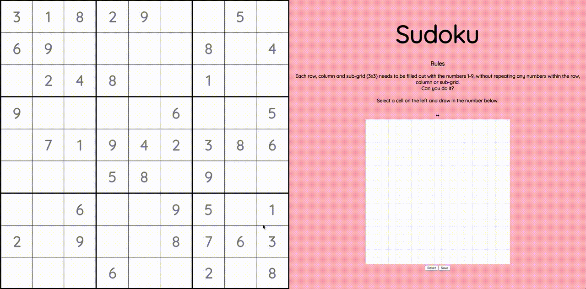

# Sudoku Handwriting

The classic game of Sudoku with handwritten digits. While tedious on a computer, this is actually pretty handy on a tablet.

Using the MNIST handwriting dataset, I trained a CNN model to classify handwritten digits. I then created a React front end that could generate an image based on user input and pass it into the model through a Flask REST API.

## Demo



## Run

In a terminal window, navigate to this project and run:

```
$ cd frontend && npm i && npm start
```

In another terminal window, run:

```
$ cd backend && pipenv install && pipenv shell
$ export FLASK_APP=app.py && flask run
```
